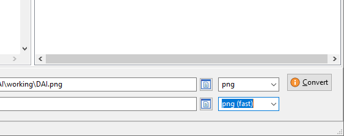

# DAI-Tools User Manual

Tools to handle DAI computer files

## How to use


1. Select your working directory
1. Select the file you want to convert
1. Input filename and file format will be filled according to file selected in 2), adjust input file type (if necessary)
1. Select output format
1. (optional) Select an output filename. If blank will be the input filename with replaced extension
1. Press convert button

The status of the conversion will be displayed in the bottom of the window.

## How to convert images
1. Open source image with your favorite Image Editor (Paint .NET in example)


1. Rescale the image, keeping aspect ratio (max 352x264)


1. Resize the image to 352x264, better to leave some border across the image, bigger on the bottom


1. Save to PNG 256 color palette with dithering enabled


1. Use DAI-Tools to see the image with DAI palette/color constrains


1. Check result and convert into desired format

 


## Command Line Version (CLI)

```
Usage:
  DTcli.exe [-h|--help]
  DTcli.exe [-c|--convert-file] save_type [options] inputfile1 [inoutfile2 [...]]
  DTcli.exe [-g|--convert-graphic] save_type [options] inputfile1 [inoutfile2 [...]]
  DTcli.exe [-f|--convert-frame] save_type [options] inputfile1 [inoutfile2 [...]]

  Command: --convert-file convert between DAI file formats
 [-o|--output] output file name (if missing is input file with extension changed)
 [-t|--input-type] input file type (if missing is input file extension)

  Command: --convert-graphic convert a PNG in different DAI file formats
 [-o|--output] output file name (if missing is input file with extension changed)
 [-q|--quantize] quantize[:numer_of_colors]
 [-d|--dither] dither ON/OFF
 [-z|--optimize] use DAI tricks to reduce the image size

  Command: --convert-frame generated a delta sequence
 [-o|--output] output file name (if missing is input file with extension changed)
 [-x|--xor] apply xor to frames
 [-t|--no-trim] skip trim of common parts

Input types allowed:
  bin -> BIN
  sbin -> SBIN
  dump -> dump
  dai -> DAI
  wav -> WAV
  hrfb -> HRFB
  png -> PNG
  png -> PNG_(big)

Output types allowed:
  BIN -> bin
  SBIN -> sbin
  dump -> dump
  asm -> asm
  PNG_(full) -> png
  PNG_(fast) -> png
  HRFB -> hrfb
  DAI_(bin) -> dai
  DAI_(basic) -> dai
  WAV -> wav
```
